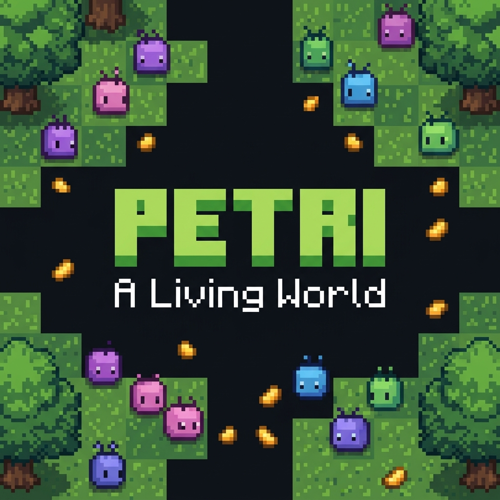

<!-- ░░ PETRI — README ░░ ─────────────────────────────────────────────── -->

<div align="center">



<!-- badges -->
<br/>


<br/>

```
┌──────────────────────────────────────────────────────────────┐
│  🌱  A shared pixel-art ecosystem that never sleeps.         │
│      Creatures eat. Creatures starve. Creatures reproduce.   │
│      You can change everything — with one food pellet.       │
└──────────────────────────────────────────────────────────────┘
```

**[▶ Open the World](https://nodejs-2b27-3000.prg1.zerops.app/) · [★ Star on GitHub](https://github.com/sanyamhbtu/Petri_A-Living-World)**

</div>

---

## 🖼️ Screenshot

<div align="center">

> *The world is always running. Every pixel you see is a live creature making a real decision.*
</div>

---

## 🌍 What is Petri?

Petri is a **live, shared, top-down pixel-art ecosystem**. It runs 24/7 and is powered by real data. Every visitor sees and interacts with the same world.

```
  🌿  Grass tiles stretch across an 18,000 × 11,000 unit meadow.
  🐛  Mosslings wander, hunt food, reproduce, and die.
  🍖  You can drop food pellets by clicking anywhere in the world.
  🔴  When energy hits zero — the creature disappears. Forever.
  💞  Two fed adults who meet will produce a child — with mutations.
  📡  Everything is synced in real-time over WebSocket at 50ms ticks.
```

This is **not a game** you win. It's a world you observe — and occasionally disturb.

---

## 🐛 The Mossling Lifecycle

```
  ╔══════════════════════════════════════════════════════════════╗
  ║                    THE MOSSLING LIFECYCLE                    ║
  ╠══════════╦══════════════════════════════════════════════════╣
  ║  BIRTH   ║  Born at the midpoint of two parents.            ║
  ║    🟣    ║  Inherits blended hue, scale, speed + mutations. ║
  ╠══════════╬══════════════════════════════════════════════════╣
  ║  WANDER  ║  Walks the meadow. Smells food within 680 units. ║
  ║    🟢    ║  Pivots and hunts it. Eating = +42 energy.       ║
  ╠══════════╬══════════════════════════════════════════════════╣
  ║  HUNGER  ║  Energy drains passively. Full = ~5 real days.   ║
  ║    🟡    ║  Faster creatures burn more. Risk vs. reward.    ║
  ╠══════════╬══════════════════════════════════════════════════╣
  ║  REPRO   ║  Mature (12h) + fed (60+ energy) + nearby mate.  ║
  ║    🩷    ║  Both spend 22 energy. Child spawns. 12h CD.     ║
  ╠══════════╬══════════════════════════════════════════════════╣
  ║  DEATH   ║  Starvation, old age (30 real days), or bad luck.║
  ║    💀    ║  Logged in the Field Notes panel. World absorbs. ║
  ╚══════════╩══════════════════════════════════════════════════╝
```

---

## ⚙️ Tech Stack

| Layer | Technology | Why |
|---|---|---|
| **Frontend** | Next.js 16 + TypeScript | Static-first, app router, RSC |
| **Rendering** | HTML Canvas (pixel art) | Zero dependencies, `image-rendering: pixelated` |
| **Real-time** | WebSocket (ws) | 50 ms server tick → live creature positions |
| **Persistence** | PostgreSQL + Drizzle ORM | World snapshots every 15 seconds |
| **Cache** | Upstash Redis | Fast read on first load, pub/sub events |
| **Styling** | Tailwind CSS v4 | Utility-first, zero config |
| **Hosting** | **Zerops** | Always-on Node.js + Postgres + Redis |

---

## 🚀 Running Locally

> **Prerequisites:** Node.js ≥ 20, pnpm, PostgreSQL, Redis (or use Zerops)

```bash
# 1. Clone
git clone https://github.com/sanyamhbtu/Petri_A-Living-World.git
cd Petri_A-Living-World

# 2. Install dependencies
pnpm install

# 3. Set up environment variables
cp .env.example .env.local
# Fill in DATABASE_URL, REDIS_URL, ADMIN_PASSWORD

# 4. Prepare the database
pnpm tsx scripts/prepare-db.ts

# 5. Start the dev server (Next.js + WebSocket together)
pnpm dev
```

Open [http://localhost:3000](http://localhost:3000) and click to drop food. 🌱

---

## ☁️ Deployment — Zerops

Petri is deployed on **[Zerops](https://zerops.io)** — a developer-focused cloud platform that runs Node.js, Postgres, and Redis without any babysitting.

```
┌─────────────────────────────────────────────────────────────┐
│  ZEROPS STACK                                               │
│                                                             │
│   ┌──────────────┐    ┌──────────────┐  ┌───────────────┐  │
│   │  Node.js     │───▶│  PostgreSQL  │  │  Upstash      │  │
│   │  (tsx server)│    │  (snapshots) │  │  Redis        │  │
│   │  + Next.js   │    │              │  │  (live cache) │  │
│   └──────────────┘    └──────────────┘  └───────────────┘  │
│          ▲                                                  │
│          │  WebSocket (ws://)  50ms tick                    │
│          ▼                                                  │
│   ┌────────────────────────────────────────────────────┐   │
│   │            Browser (all visitors, one world)       │   │
│   └────────────────────────────────────────────────────┘   │
└─────────────────────────────────────────────────────────────┘
```

**Live at:** [https://nodejs-2b27-3000.prg1.zerops.app/](https://nodejs-2b27-3000.prg1.zerops.app/)

See [`zerops.yaml`](zerops.yaml) for the full deployment config.

---

## 🗂️ Project Structure

```
Petri_A-Living-World/
│
├── app/
│   ├── page.tsx               ← Landing page
│   ├── playground/page.tsx    ← Live world
│   └── api/petri/             ← REST fallback API
│
├── components/
│   ├── petri/
│   │   ├── simulation.ts      ← Core ecosystem engine (pure functions)
│   │   ├── world-canvas.tsx   ← Pixel-art canvas renderer
│   │   ├── petri-app.tsx      ← WebSocket client + UI shell
│   │   ├── landing-page.tsx   ← Landing page component
│   │   └── types.ts           ← Shared types
│   └── originkit/ui/
│       └── tornado.tsx        ← Vortex background component
│
├── lib/
│   ├── db/                    ← Drizzle ORM + schema
│   └── redis.ts               ← Upstash Redis client
│
└── server.ts                  ← Custom Node.js server (HTTP + WebSocket)
```

---

## 🧬 Simulation Constants

These govern the entire ecosystem. Tweak them and watch evolution happen:

```typescript
ENERGY_MAX              = 100         // Max creature energy
STARVATION_MS           = 5 * DAY_MS  // ~5 real days without food = death
BASE_METABOLISM         = 0.000000463 // Energy/ms at rest
MOVE_METABOLISM         = 0.1         // Extra drain per unit of speed
MAX_AGE_MS              = 30 * DAY_MS // Old age cap
FOOD_TARGET             = 60          // Standing food supply
FOOD_ENERGY             = 42          // Energy restored per meal
REPRODUCTION_MIN_AGE    = 12h         // Must be an adult first
REPRODUCTION_COOLDOWN   = 12h         // One child per 12 hours
REPRODUCTION_MIN_ENERGY = 60          // Must be well-fed
MAX_CREATURES           = 180         // Population cap
```

---

## 🤝 Contributing

This world is open source and waiting for your pull request.

```
fork → clone → branch → code → test → PR
```

**Ideas to explore:**
- 🦎 Add a second species with different behavior (predator? herbivore?)
- 🌧️ Add weather events (rain = more food, drought = less)
- 🧬 More complex genetic traits (field of view, turning speed)
- 🗺️ Biomes with different food density
- 📊 A live population graph in the sidebar

```bash
# Run the simulation test suite
pnpm test:simulation
# → 18 tests, 18 passing ✓
```

---

## 📜 License

MIT — do whatever you want with it. If you build something cool, open a PR or drop a ⭐.

---

<div align="center">

```
  ░░░░░░░░░░░░░░░░░░░░░░░░░░░░░░░░░░░░░░░░░░░░░░░░░░░░░░░░░░░
  ░  🌿  Built for slow observation  ·  Powered by Zerops  🚀 ░
  ░░░░░░░░░░░░░░░░░░░░░░░░░░░░░░░░░░░░░░░░░░░░░░░░░░░░░░░░░░░
```

**[▶ Enter the World →](https://nodejs-2b27-3000.prg1.zerops.app/)**

</div>
